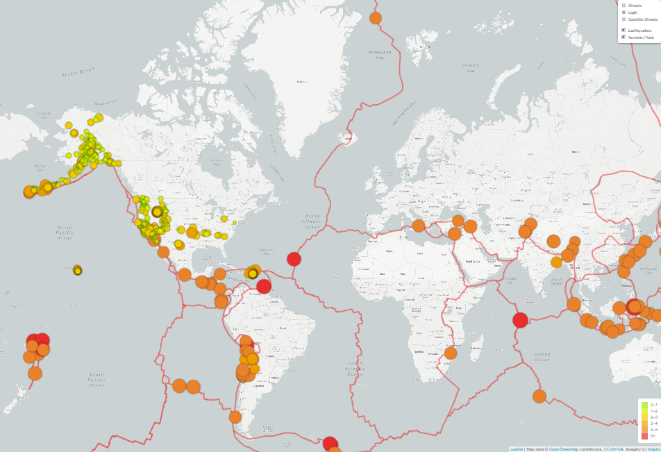

# Mapping_Earthquakes
Use the **Leaflet.js Application Programming Interface (API)** to populate a geographical map with **GeoJSON** earthquake data from a URL

## Steps
• Retrieve data from a **GeoJSON** file. 
• Make **API request**s to a server to host geographical maps. 
• Populate geographical maps with GeoJSON data using **JavaScrip**t and the **Data-Driven Documents (D3) library**. 
• Add *multiple map layers* to geographical maps using **Leaflet** control plugins to add *user interface controls*. 
• Use **JavaScript ES6 functions** to add GeoJSON data, features, and interactivity to maps. 
• Render maps on a local server.

## Discussion
Add a third map style as an additional tile layer, add tectonic plate GeoJSON data to the map to illustrate the relationship between the location and frequency of seismic activity and tectonic plates.

•	Use **d3.json()** to get tectonic plate data and add the data using the **L.geoJSON()** layer.  
•	Style the tectonic plate LineString data to stand out on the map. 
•	Add the tectonic plate data as an overlay with the earthquake data. 
•	Add a third map style to allow the user to select from three different maps.

The code is in [index.html](https://github.com/plin2204/Mapping_Earthquakes/blob/master/index.html).

